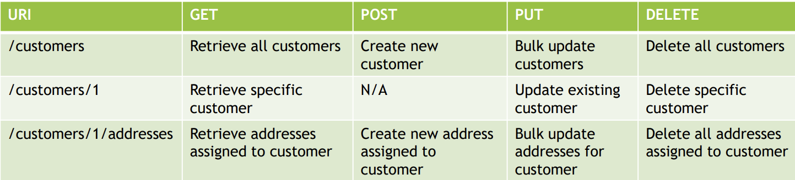
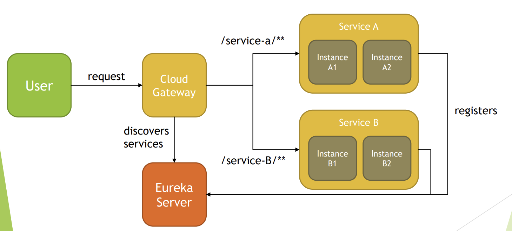

Spring REST
------------

REST
 -----

1. REST stands for REpresentational State Transfer.
2. It is an architectural style of designing distributed applications, in which
   requesting system accesses and manipulates textual representations of
   Web resources by using a uniform and predefined set of stateless
   operations, given a set of constraints
3. Web resources are made available through URIs (Uniform Resource
   Identifiers) and are accessed or modified, usually through HTTP
   operations.
4. For example:
   1. GET /customers
   2. GET /customers/1
   3. PUT /customers/6
   4. DELETE /customers/3
5. Most implementations of REST services are using HTTP as the application
   protocol, and JSON as format that moves data between caller and callee.
   However REST is not necessarily tied to HTTP or JSON. 
6. REST defines constraints to be used for creating Web services, aligning with
   those constraints results in gaining non-functional properties of system, such
   as performance, scalability, simplicity, modifiability, visibility, portability,
   and reliability
   1. Client-server architecture and Separation of Client-Server concerns
   2. Statelessness
   3. Cacheability
   4. Uniform interface
      1. Resource identification in requests
      2. Resource manipulation through representations
      3. Self-descriptive messages
      4. Hypermedia as the engine of application state
   5. Layered system
   6. Code on demand (optional)
7. Requesting system interacts with the target system, usually by HTTP
   requests which should follow those semantics:
    ```
   HTTP Method(verb) + URI(noun (plural form)
   GET /customers
   GET /customers/1
   PUT /customers/6
   PATCH /customers/7
   DELETE /customers/3

    ```
8. REST services often allow you to perform all CRUD operations for specified
   resources:
   1. C – create
   2. R – read
   3. U – update
   4. D - delete
9. Following HTTP Methods are usually used with REST services:
   1. GET – fetch resource or collection of resources at the specified URI
   2. PUT – create new resource, or update existing resource at the
      specified URI
   3. PATCH – partially updates existing resource at the specified URI, for
      example update only firstName of Customer
   4. DELETE – delete resource at the specified URI
   5. POST – triggers operation at server or creates a new resource at the
      specified URI
   6. Other HTTP Methods that REST service can support are: HEAD,
      CONNECT, OPTIONS, TRACE.
10. In case of request processing error, REST service should respond in a way for it to
    be easily to understand cause of issue. Error return to requester usually includes:
    1. HTTP Status Code
    2. Code ID
    3. Human readable error message that explains error
11. HTTP Status Code should fall within one of the groups:
    1. 1xx – Informational
    2. 2xx – Success
       1. 200 OK
       2. 201 Created
       3. 204 No Content
    3. 3xx – Redirection
    4. 4xx - Client Error
       1. 400 Bad Request
       2. 401 Unauthorized
       3. 403 Forbidden
       4. 404 Not Found
    5. 5xx - Server Error
       1. 500 Internal Server Error
       2. 501 Not Implemented
12. REST API should be backward compatible as long as possible, in case of
    introducing breaking change, one of versioning methods should be used:
    1. URI versioning
       1. /api/v1/products
    2. Query string versioning
       1. /api/products?version=1
    3. Header versioning
       1. /api/products
       2. Header - Accepts-version: 1.0
    4. Media type content negotiation versioning
       1. /api/products
       2. Header - Accept: application/vnd.my-app.v1+json

Resource
---
1. Resource is a named information available via URI. It can be a document,
   image, video, text file, etc. REST uses different form of presentation of
   resources, and client can specify format in which Resource should be
   made available, for example JSON, XML, Text, Html etc.
2. Resource can be made available as single resource or collection of
   resources. Resources can also have relationship with each other, often
   used relation is “contained in” expressed by sub-collections.
3. REST usually provides set of methods that can be used to manipulate
   resources, like HTTP GET, POST, PUT, DELETE etc.

CRUD
---
1. CRUD stands for:
   1. Create
   2. Read
   3. Update
   4. Delete
2. those are basic operations of data store. All of those, or subset of them
   may be implemented in REST service.
3. When using HTTP as application layer in REST, following HTTP methods
   are used for implementation:
   1. Create -> HTTP POST / HTTP PUT
   2. Read -> HTTP GET
   3. Update -> HTTP PUT / HTTP PATCH
   4. Delete -> HTTP DELETE
4. Here are example conventions often used when implementing CRUD in
   REST.
   

Is REST secure
---------
1. REST as an architectural style of developing distributed applications,
   does not enforce any security rules or solutions on it’s own, so by default
   REST is not secured.
2. However, since it suggests layered approach to system design, security
   can be added later in the process
3. In Spring, this can be easily achieved by using Spring REST and Spring
   Security module.
4. To secure REST API, you can do following:
   1. Protect in-transit traffic by using HTTPS protocol
   2. Use some form of Authentication (Basic, JSON Tokens, ...)
   3. Use some form of Authorization (Spring Roles)

Is REST scalable and/or interoperable
--------------------
1. Scalability of RESTful Service is a result of developing software with
   following characteristics in mind:
   1. `Statelessness` - each request to the system, should be design in a way, for
      it to be processed without having to keep any state at the backend side,
      for example, we want to avoid keeping information in HTTP Session
      related to user conversation with the system, this way we can delegate
      request to any backend node that can process the request without having
      to introduce share state between nodes
   2. Layered Approach – layered approach to the system design means that
      we can introduce new parts of the system in a way for it to be
      transparent to the client, resulting in ability to change system without
      having to modify client, example of this can be introduction of
      Application Load Balancer, API Gateway, Security Layers, Web Application
      Firewall without having to change client at all
   3. Cacheability – allows to create response for repeatable requests, without
      having to process them on service side, caching is introduced to improve
      response time and to reduce load on the service
2. Scalability that can be achieved by statelessness of RESTful Service is especially visible in Microservice
      Architecture, that can be created with usage of Spring Cloud Components. Layered Approach allows
      introduction of additional components without changing client application.
      
3. REST Service is interoperable because:
   1. Access to REST Service and resources available by URIs is standardized
      and not coupled with any specific technology, allowing you to
      consume REST Service in any technology of choice, like JavaScript,
      Python, Java, C++ etc.
   2. Data for the requested resource can be sent to client in different
      formats specified by the client, in case of HTTP protocol this can be
      done with usage of Accept header, for example Accept:
      application/json or Accept: application/xml
   3. All CRUD operations can be handled with standardized approach, in
      case of RESTful Service implemented with HTTP protocol,
      standardized HTTP methods GET, PUT, PATCH, POST, DELETE
      are used

REST uses following HTTP methods:
--------------------
1. HTTP GET – used to implement Read Operations – fetch existing
   resource or list of resources
2. HTTP POST – used to implement Create Operations – adding new
   element
3. HTTP PUT – used to implement Create or Update Operations – Bulk
   Update or Update of existing resource
4. HTTP PATCH – partial update of existing resource of the system, for
   example, when wanting to update only First Name of Customer entity
5. HTTP DELETE – delete existing resource in the system
6. Example
   [Source code](IntroToRest)

HttpMessageConverter
------------------
1. HttpMessageConverter is an interface used by Spring to convert data between
   different formats.
2. REST client can specify expected format in which data should be retrieved by usage of
   Accept Header, for example Accept: application/json. Client can also
   specify format in which data will be send by usage of Content-Type Header, for
   example Content-Type: application/xml.
3. Spring keeps list of HttpMessageConverters and for each request, data formats
   requested are being analyzed and cross referenced with methods implemented in
   Controllers. Whenever match is found Spring executes proper Controller
   Method and picks HttpMessageConverter to perform data conversion.
4. Request Mapping annotations contains produces and consumes fields which can be
   used to specify MediaType which method can handle.
5. Having method identified HttpMessageConverter is used to:
   1. Convert HttpInputMessage to desired Type
   2. Convert Type to HttpOutputMessage
6. HttpMessageConverter interface specifies contract for following behaviors:
   1. canRead - indicates whether given MediaType can be read by converter
   2. canWrite - indicates whether given MediaType can be written by converter
   3. getSupportedMediaTypes - returns supported list of MediaTypes
   4. read – Converts HttpInputMessage to Type
   5. write – Converts Type to HttpOutputMessage